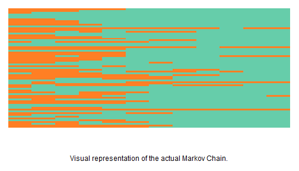
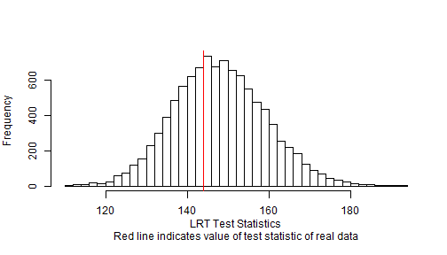
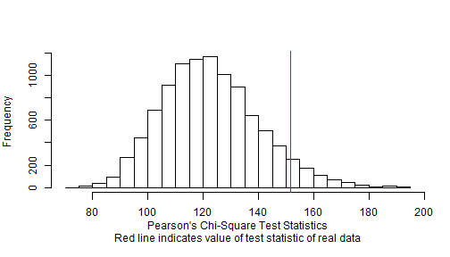
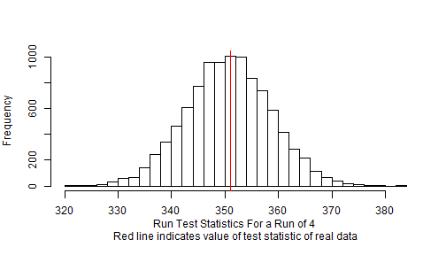

The Madras Schizophrenia Study was a long term longitudinal study on the presence of schizophrenia in men and women in the Indian city of Madras, which is now known as Chennai. The data used in this vignette has been sourced from a book on longitudinal studies called "Analysis of Longitudinal Data" that can be found at [http://faculty.washington.edu/heagerty/Books/AnalysisLongitudinal/].

The data found in `madras` is encoded as a data frame with 69 rows and 12 columns, with each row representing a different paitent, and each column representing a month since initial hospitalization. A 1 represents a month in which symptoms were present, and a 0 represents one in which none were. The original dataset from the book featured 86 different individuals, both men and women, but not all of them were followed up on for 12 whole months. Since the program `multiple.binary.test()` requires rectangular data, these individuals were removed from the dataset, leaving us with the 69 individuals mentioned.

The first thing that we need to do is to transform our data into something that the maRkov package can understand. `multiple.binary.test()` takes a binary matrix as input, so that's what we will transform our data into:


```r
library(maRkov)
madras <- as.matrix(madras)
head(madras)
```

```
##   Jan Feb Mar Apr May Jun Jul Aug Sep Oct Nov Dec
## 1   1   1   1   1   1   0   0   0   0   0   0   0
## 2   1   1   1   0   0   0   0   0   0   0   0   0
## 3   1   0   0   0   0   0   0   0   0   0   0   0
## 4   0   0   0   0   0   0   0   0   0   0   0   0
## 5   0   0   0   0   0   0   0   0   0   0   0   0
## 6   0   0   0   0   0   0   0   0   0   0   0   0
```

```r
str(madras)
```

```
##  num [1:69, 1:12] 1 1 1 0 0 0 1 1 1 1 ...
##  - attr(*, "dimnames")=List of 2
##   ..$ : chr [1:69] "1" "2" "3" "4" ...
##   ..$ : chr [1:12] "Jan" "Feb" "Mar" "Apr" ...
```

Looks great! Now, ideally we would want to examine each of these chains seperately to see if a single binary Markov chains are appropriate models for each of them. Unfortunately, given the fact that chain is extremely short. However, since we have many of them, we can asses them all taken together to see if a simple binary Markov model is appropriate when compared to a second order chain.


```r
madras.test <- multiple.binary.test(madras, swaps = 10000, n = 10000)
```

And then we'll plot our results to see if we can identify any patterns:


```r
plot(madras.test)
```



As you can see from the histogram plots, it does not seem that there is any significant issue with using one Markov chain to model all of the data. Let's look at a more detailed summary to be sure:


```r
summary(madras.test)
```

```
## 
## call:
## multiple.binary.test(binary.chains = madras, swaps = 10000, n = 10000)
## 
## Test statistics
##                  Min          1Q      Median          3Q         Max   test stat  Pr(>test stat)
## LRT	    111.8596    140.2108    147.6129    155.3198    193.6285    143.9377   0.6291371 
## ChiSq	    74.20424    110.2074    121.2019    133.5018    193.8276    151.5796  0.06009399 .
## Run =  4         321         346         351         357         383         351   0.5340466 
## ---
## Signif. codes: 0 '***' 0.001 '**' 0.01 '*' .05 '.' .1 ' ' 1
## ---
```

As you can see, the high likelihood ratio p-value suggusts no reason to reject the hypothesis that a single Markov chain can be used instead of multiples.
