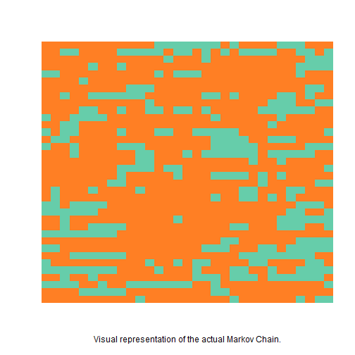
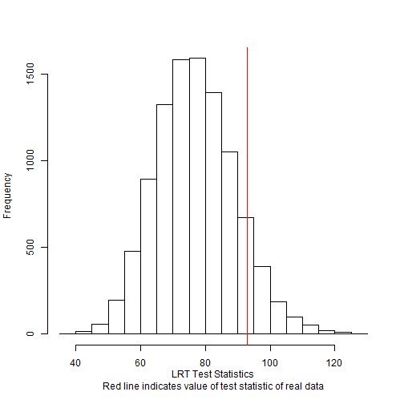
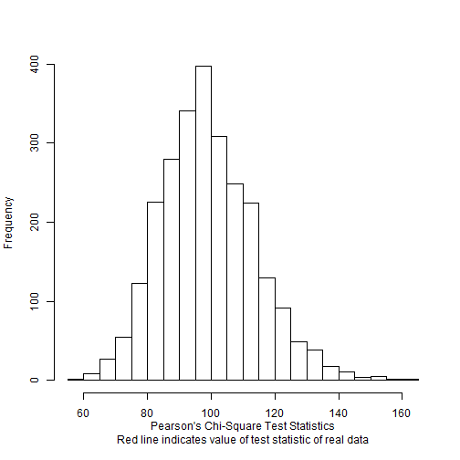
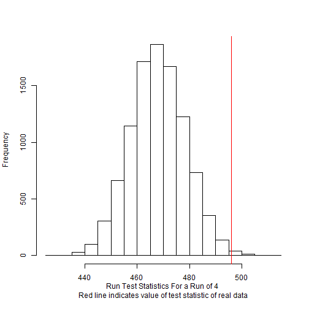

It rains a lot in Washington. This will come as no surprise to anyone who has been to the Evergreen State, but the specific patterns of the rainfall in the region are important to scientists. For this example, we will be investigating whether precipitation at Snoqualmie Falls Washington can be modeled with a set of binary Markov chains. To determine the answer to this question, we will be testing the null hypothesis of a simple binary chain against the alternative of a second order binary chain.

To do this, we will be using the `multiple.binary.test()` function. But first we need to encode the rainfall data in the proper way. The data is below. Note that a "1" denotes that there was more than 0.01 inches of rain on a given day, and a "0"" denotes that there was less rainfall than that. Each row is a separate year and each column is a day of the month of January.


|     |  1|  2|  3|  4|  5|  6|  7|  8|  9| 10| 11| 12| 13| 14| 15| 16| 17| 18| 19| 20| 21| 22| 23| 24| 25| 26| 27| 28| 29| 30| 31|
|:----|--:|--:|--:|--:|--:|--:|--:|--:|--:|--:|--:|--:|--:|--:|--:|--:|--:|--:|--:|--:|--:|--:|--:|--:|--:|--:|--:|--:|--:|--:|--:|
|1948 |  1|  1|  1|  1|  1|  1|  1|  1|  1|  1|  1|  1|  0|  0|  0|  0|  0|  0|  0|  1|  0|  1|  1|  1|  1|  0|  0|  0|  1|  1|  1|
|1949 |  1|  1|  0|  0|  1|  1|  1|  1|  0|  0|  0|  0|  0|  1|  0|  0|  1|  0|  1|  0|  1|  0|  0|  0|  0|  1|  1|  0|  0|  1|  0|
|1950 |  1|  1|  1|  1|  1|  1|  1|  1|  1|  1|  1|  1|  1|  0|  1|  1|  1|  0|  1|  1|  1|  1|  1|  1|  1|  1|  1|  1|  0|  0|  0|
|1951 |  1|  1|  1|  1|  1|  0|  1|  1|  0|  1|  1|  1|  1|  1|  1|  1|  1|  1|  1|  1|  1|  1|  1|  1|  1|  1|  1|  0|  0|  0|  0|
|1952 |  0|  0|  1|  1|  1|  1|  1|  1|  1|  1|  1|  1|  0|  1|  0|  0|  0|  1|  1|  1|  1|  1|  1|  1|  1|  1|  1|  0|  1|  1|  1|
|1953 |  1|  1|  1|  1|  0|  1|  1|  1|  1|  1|  1|  1|  1|  1|  1|  1|  1|  1|  1|  1|  1|  1|  1|  1|  1|  1|  1|  1|  1|  1|  1|
|1954 |  1|  1|  1|  1|  1|  1|  1|  1|  1|  0|  0|  0|  1|  1|  1|  1|  1|  1|  1|  1|  1|  1|  1|  1|  1|  1|  1|  1|  0|  0|  1|
|1955 |  1|  1|  0|  1|  1|  0|  0|  0|  0|  0|  0|  1|  1|  1|  1|  1|  1|  0|  0|  1|  0|  1|  1|  1|  1|  0|  0|  1|  0|  1|  1|
|1956 |  1|  1|  1|  1|  1|  1|  1|  1|  1|  1|  1|  0|  1|  1|  1|  1|  1|  1|  1|  1|  1|  1|  1|  1|  0|  0|  0|  1|  1|  0|  0|
|1957 |  1|  1|  1|  1|  0|  0|  1|  1|  0|  1|  1|  0|  0|  1|  0|  0|  1|  0|  1|  1|  1|  1|  1|  0|  0|  0|  0|  0|  0|  1|  1|
|1958 |  0|  1|  1|  0|  0|  0|  0|  1|  1|  1|  1|  1|  1|  1|  1|  1|  1|  1|  0|  1|  1|  1|  1|  1|  1|  0|  1|  1|  1|  1|  1|
|1959 |  1|  1|  0|  0|  1|  1|  1|  1|  1|  1|  1|  1|  1|  1|  1|  1|  1|  1|  1|  1|  1|  1|  1|  1|  0|  1|  1|  1|  1|  1|  1|
|1960 |  0|  1|  0|  0|  1|  1|  1|  1|  0|  1|  1|  1|  0|  0|  1|  1|  0|  0|  0|  0|  0|  1|  1|  1|  1|  1|  1|  1|  1|  1|  0|
|1961 |  1|  0|  0|  1|  1|  1|  1|  1|  1|  1|  1|  1|  1|  1|  1|  1|  1|  1|  0|  0|  0|  0|  1|  1|  0|  0|  0|  1|  1|  1|  1|
|1962 |  0|  1|  1|  0|  1|  1|  1|  1|  0|  0|  0|  1|  1|  1|  1|  1|  1|  1|  0|  0|  0|  0|  0|  1|  1|  1|  1|  1|  0|  0|  0|
|1963 |  1|  1|  1|  0|  1|  1|  1|  1|  1|  1|  0|  0|  1|  1|  1|  0|  1|  0|  0|  0|  0|  0|  0|  1|  0|  0|  0|  0|  0|  1|  1|
|1964 |  1|  1|  1|  1|  1|  1|  1|  1|  1|  1|  0|  0|  1|  1|  1|  1|  1|  1|  1|  1|  1|  1|  0|  1|  1|  0|  1|  1|  1|  1|  1|
|1965 |  1|  1|  1|  1|  1|  1|  1|  1|  0|  0|  0|  0|  1|  0|  0|  1|  1|  1|  1|  1|  1|  1|  1|  1|  1|  1|  1|  1|  1|  1|  0|
|1966 |  1|  1|  1|  1|  1|  1|  1|  1|  0|  1|  1|  1|  1|  1|  0|  1|  1|  1|  0|  0|  0|  0|  1|  0|  1|  0|  1|  1|  1|  1|  1|
|1967 |  1|  1|  1|  1|  1|  1|  1|  0|  0|  1|  1|  1|  1|  1|  1|  1|  1|  1|  1|  1|  1|  1|  1|  0|  1|  1|  1|  1|  1|  0|  0|
|1968 |  1|  0|  1|  1|  1|  0|  1|  1|  1|  1|  0|  1|  1|  1|  1|  1|  1|  1|  1|  1|  1|  0|  0|  1|  1|  1|  0|  0|  1|  1|  1|
|1969 |  1|  0|  1|  1|  1|  1|  1|  1|  1|  1|  1|  1|  1|  1|  1|  1|  1|  1|  0|  1|  1|  0|  0|  1|  0|  1|  0|  1|  1|  1|  1|
|1970 |  0|  0|  1|  0|  0|  0|  0|  1|  1|  1|  1|  1|  1|  1|  1|  1|  1|  1|  1|  1|  1|  1|  1|  1|  1|  1|  1|  0|  0|  0|  1|
|1971 |  0|  0|  0|  0|  0|  0|  1|  1|  1|  1|  1|  1|  1|  1|  1|  1|  1|  1|  1|  1|  1|  1|  1|  1|  1|  1|  0|  0|  1|  1|  0|
|1972 |  1|  1|  0|  1|  1|  1|  1|  1|  1|  1|  1|  1|  1|  1|  0|  1|  1|  1|  1|  1|  1|  1|  1|  1|  1|  0|  0|  0|  0|  0|  0|
|1973 |  1|  1|  0|  1|  1|  0|  0|  0|  0|  1|  1|  1|  1|  1|  1|  1|  1|  1|  1|  1|  0|  0|  1|  1|  1|  0|  0|  0|  1|  1|  0|
|1974 |  0|  0|  0|  0|  0|  0|  0|  0|  1|  1|  1|  1|  1|  1|  1|  1|  1|  1|  1|  1|  1|  1|  1|  1|  1|  1|  1|  1|  1|  1|  1|
|1975 |  1|  1|  1|  1|  1|  1|  1|  1|  1|  1|  1|  1|  1|  1|  1|  1|  1|  1|  1|  0|  0|  1|  1|  1|  1|  1|  1|  0|  0|  0|  0|
|1976 |  0|  0|  1|  1|  1|  1|  1|  1|  1|  1|  1|  1|  1|  1|  1|  1|  1|  0|  0|  0|  1|  1|  1|  0|  0|  1|  0|  0|  0|  0|  0|
|1977 |  1|  1|  1|  0|  0|  0|  0|  0|  0|  1|  1|  1|  1|  1|  1|  1|  1|  1|  1|  1|  1|  0|  0|  0|  0|  0|  0|  0|  0|  1|  1|
|1978 |  0|  1|  1|  1|  1|  1|  1|  1|  1|  1|  1|  0|  1|  1|  0|  1|  0|  0|  1|  1|  1|  1|  0|  0|  1|  1|  1|  1|  0|  0|  1|
|1979 |  0|  0|  0|  0|  0|  0|  0|  0|  1|  1|  1|  1|  0|  1|  1|  1|  0|  1|  1|  1|  0|  0|  1|  1|  0|  1|  1|  0|  0|  0|  0|
|1980 |  1|  1|  0|  1|  1|  0|  1|  1|  1|  1|  1|  1|  1|  1|  1|  1|  0|  0|  0|  1|  0|  0|  0|  1|  0|  0|  0|  0|  0|  0|  1|
|1981 |  0|  0|  0|  0|  1|  1|  0|  1|  1|  0|  0|  0|  0|  0|  0|  0|  1|  1|  0|  1|  1|  1|  1|  1|  1|  1|  1|  1|  1|  1|  0|
|1982 |  1|  1|  1|  1|  0|  0|  0|  0|  0|  1|  1|  1|  1|  1|  1|  1|  1|  1|  0|  0|  1|  1|  1|  1|  1|  1|  1|  1|  1|  1|  1|
|1983 |  1|  1|  1|  1|  1|  1|  1|  1|  1|  1|  0|  1|  1|  1|  1|  1|  1|  1|  1|  1|  0|  1|  1|  1|  1|  1|  1|  0|  1|  0|  0|

We'll need to encode this data in a way that `multiple.binary.test()` can understand, so we're going to turn it into a matrix with rows representing each single year chain, and columns representing days of January. Luckily, the as.matrix function makes it easy to do this.


```r
snoqualmie.matrix <- as.matrix(maRkov::snoqualmie)
```

We're finally ready to call `multiple.binary.test()`, which will produce an object of class `multiple.binary.test`. Afterwards, we'll look at some plots and a summary of our data. Specifically, we'll be taking a look at the distribution of test statistics and the p-value for the likelihood ratio test (LRT). This test will give us a answer to the question of whether or not the null hypothesis of a single binary chain is acceptable against the alternative of a second order binary chain.


```r
snoqualmie.test <- multiple.binary.test(binary.chains = snoqualmie.matrix, swaps = 10000, n = 10000)
plot(snoqualmie.test)
```


By looking at these plots, we notice a few things. First, plotting a object of class `multiple.binary.test` gives us a whole lot of information, much of which isn't particularly interesting to us. We'll just be looking at the tile plot and the histogram of likelihood ratio test statistics. The tile plot lets us get a general feel for the makeup of our set of chains, and the histogram of likelihood ratio statistics shows us that the test statistic of the real set of chains lies somewhere in the meaty part of the distribution, making it unlikely that it is an unusual observation. For more detailed and precise analysis, let's turn our attention to the summary of `snoqualmie.test`.

```r
summary(snoqualmie.test)
```

```
## 
## call:
## multiple.binary.test(binary.chains = snoqualmie.matrix, swaps = 10000, 
##     n = 10000)
## 
## Test statistics
##                  Min          1Q      Median          3Q         Max   test stat  Pr(>test stat)
## LRT	    39.79786    68.42367    76.41031    84.89573    129.6671    92.79758   0.1017898 
## ChiSq	    56.54883    128.9819         Inf         Inf         Inf         Inf   0.7411259 
## Run =  4         427         461         468         476         512         496  0.00539946 **
## ---
## Signif. codes: 0 '***' 0.001 '**' 0.01 '*' .05 '.' .1 ' ' 1
## ---
```
While the output of this code is a little jumbled due to the formatting that knitr coerces it into, you can see the general structure of the output. The likelihood ratio test statistics are broken down by quantile, and there is a p-value printed next to them as well. In this case, the p-value of the likelihood ratio test indicates that a single binary chain is probably acceptable for modeling this data.
